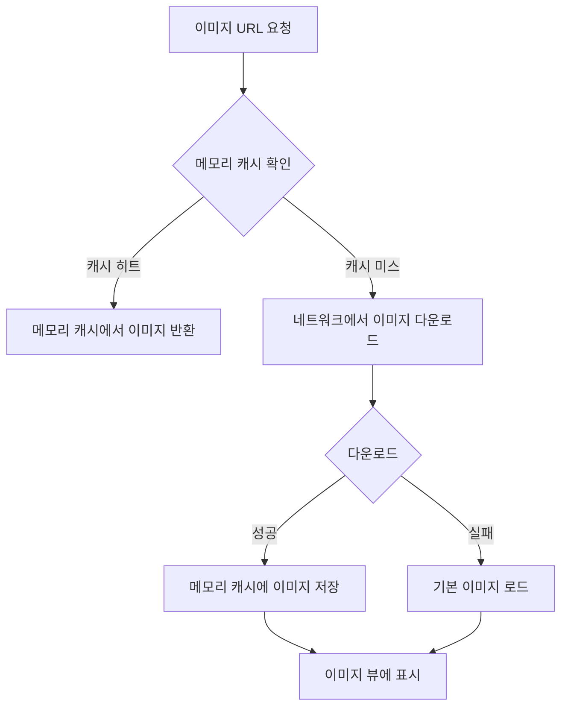

# ImageLoader

## 프로젝트 설명
외부 API에서 썸네일 이미지 목록을 불러와 GridView 형태로 출력하는 안드로이드 앱입니다. 
Glide 라이브러리를 사용하여 이미지 로딩 및 캐싱 성능을 최적화하였으며, 가로/세로 모드에 따라 유연하게 레이아웃을 조정합니다.

## 실행 방법
1. Android Studio에서 프로젝트 클론
2. Gradle Sync
3. 에뮬레이터 또는 안드로이드 기기에서 앱 실행

## 개발 환경
- `Android Studio`
- `Kotlin 1.9.0`
- `Gradle 8.0`
- 최소 SDK 버전: `Android 24 (API 24)`
- 대상 SDK 버전: `Android 35 (API 35)`

## 사용 라이브러리

### 이미지 및 캐싱
- **Glide `4.16.0`**
    - 목적: 이미지 로딩 및 캐싱
    - 기능:
        - 비동기 이미지 로딩
        - 메모리/디스크 캐싱
        - 이미지 변환 및 최적화

### 네트워크 및 데이터 처리
- **Retrofit `2.9.0`**
    - 목적: HTTP API 통신
    - 기능:
        - REST API 호출
        - JSON 직렬화/역직렬화

- **Jsoup `1.15.3`**
    - 목적: HTML 파싱 및 웹 크롤링
    - 기능:
        - HTML 데이터 추출
        - 웹 스크래핑

### UI 컴포넌트
- **RecyclerView `1.3.1`**
    - 목적: 동적 리스트 렌더링
    - 기능:
        - 대량 데이터 효율적 표시
        - 뷰 재활용

- **ConstraintLayout `2.1.4`**
    - 목적: 유연한 레이아웃 설계
    - 기능:
        - 복잡한 레이아웃 단순화
        - 성능 최적화
      

## 구현 기능 목록

### 🔻 SOOP LOGO

### 🔻 세로 모드 (이미지 3열 출력)

### 🔻 가로 모드 (이미지 4열 출력)

- 외부 API에서 이미지 URL 리스트 로드
- 가로/세로 모드 레이아웃 지원 (가로 4열, 세로 3열)
- Glide를 이용한 이미지 캐싱 및 효율적 로딩
- 에러 발생 시 기본 이미지 대체 기능
- 반응형 그리드 레이아웃 구현

## 이미지 로더 동작 순서도 

## 이미지 로딩 세부 프로세스

1. 이미지 URL 요청
2. 메모리 캐시 확인
   - 캐시된 이미지 존재 시 즉시 반환
3. 네트워크에서 이미지 다운로드
4. 다운로드 성공 시 메모리 캐시에 저장
5. 이미지 뷰에 이미지 표시
6. 다운로드 실패 시 기본 이미지 대체

## 주요 특징
- 안정적인 이미지 로딩 메커니즘
- 메모리 및 디스크 캐시 최적화
- 네트워크 예외 처리 및 대체 이미지 지원
- 매직 넘버를 상수로 대체하여 코드의 가독성과 유지보수성 개선
