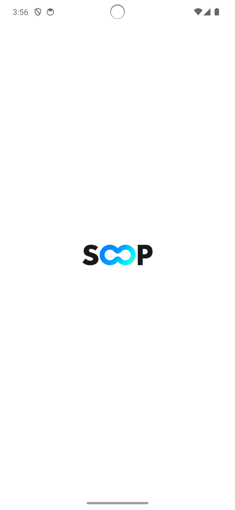
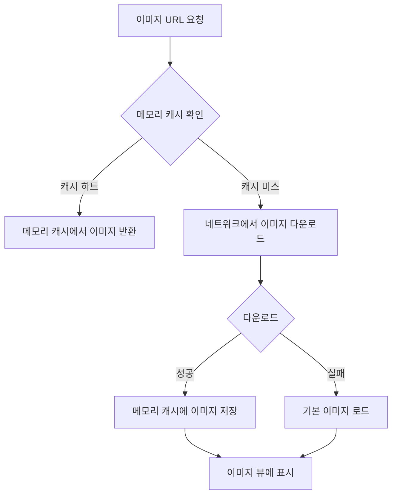

# ImageLoader

## 프로젝트 설명
외부 API에서 썸네일 이미지 목록을 불러와 GridView 형태로 출력하는 안드로이드 앱입니다. 
Glide 라이브러리를 사용하여 이미지 로딩 및 캐싱 성능을 최적화하였으며, 가로/세로 모드에 따라 유연하게 레이아웃을 조정합니다.


## 실행 방법
1. Android Studio에서 프로젝트 클론
2. Gradle Sync
3. 에뮬레이터 또는 안드로이드 기기에서 앱 실행

## 개발 환경
- `Android Studio`
- `Kotlin 1.9.0`
- `Gradle 8.0`
- 최소 SDK 버전: `Android 24 (API 24)`
- 대상 SDK 버전: `Android 35 (API 35)`

## 프로젝트 폴더 구조
```plaintext
app/
├── build.gradle
└── src/
    └── main/
        ├── java/
        │   └── com/
        │       └── example/
        │           └── myapplication/
        │               ├── MainActivity.java
        │               ├── MyAppGlideModule.java
        │               ├── adapter/
        │               │   └── ImageAdapter.java
        │               ├── model/
        │               │   └── ImageItem.java
        │               ├── repository/
        │               │   └── ImageRepository.java
        │               ├── utils/
        │               │   ├── CacheMetrics.java      # 캐시 성능 측정
        │               │   ├── Constants.java         # 상수 정의
        │               │   └── MemoryMonitor.java     # 메모리 모니터링
        │               └── viewmodel/
        │                   └── MainViewModel.java
        │
        ├── res/
        │   ├── drawable/
        │   │   ├── ic_aqua.xml
        │   │   ├── ic_bell.xml
        │   │   ├── ic_menu.xml
        │   │   ├── ic_search.xml
        │   │   ├── ic_settings.xml
        │   │   └── soop_logo.xml
        │   ├── layout/
        │   │   ├── activity_main.xml
        │   │   ├── header_layout.xml
        │   │   └── item_image.xml
        │   └── values/
        │       ├── colors.xml
        │       ├── strings.xml
        │       └── themes.xml
        │
        └── AndroidManifest.xml
```
### MVVM 구조 사용

- 코어 클래스
    - `MainActivity.java`: 메인 화면 활동
    - `MyAppGlideModule.java`: Glide 설정

- 구성요소별 패키지
    - `adapter/`: RecyclerView 어댑터
    - `model/`: 데이터 모델 클래스
    - `repository/`: 데이터 처리 로직
    - `viewmodel/`: UI 상태 관리
    - `utils/`: 유틸리티 클래스

- 리소스 파일
    - `drawable/`: 아이콘 및 이미지
    - `layout/`: 레이아웃 XML 파일
    - `values/`: 리소스 값들
  
- 성능 테스트 관련
    - `CacheMetrics.java`: 캐시 성능 측정
    - `MemoryMonitor.java`: 메모리 사용량 모니터링
    - `Constants.java`: 상수 정의

## 사용 라이브러리

### 이미지 및 캐싱
- **Glide `4.16.0`**
    - 목적: 이미지 로딩 및 캐싱
    - 기능:
        - 비동기 이미지 로딩
        - 메모리/디스크 캐싱
        - 이미지 변환 및 최적화

### 네트워크 및 데이터 처리
- **Retrofit `2.9.0`**
    - 목적: HTTP API 통신
    - 기능:
        - REST API 호출
        - JSON 직렬화/역직렬화

- **Jsoup `1.15.3`**
    - 목적: HTML 파싱 및 웹 크롤링
    - 기능:
        - HTML 데이터 추출
        - 웹 스크래핑

### UI 컴포넌트
- **RecyclerView `1.3.1`**
    - 목적: 동적 리스트 렌더링
    - 기능:
        - 대량 데이터 효율적 표시
        - 뷰 재활용

- **ConstraintLayout `2.1.4`**
    - 목적: 유연한 레이아웃 설계
    - 기능:
        - 복잡한 레이아웃 단순화
        - 성능 최적화
      

## 구현 기능 목록

### 🔻 SOOP LOGO


### 🔻 세로 모드 (이미지 3열 출력)


### 🔻 가로 모드 (이미지 4열 출력)


### 📹 세로 모드에서 가로 모드 전환


- 외부 API에서 이미지 URL 리스트 로드
- 가로/세로 모드 레이아웃 지원 (가로 4열, 세로 3열)
- Glide를 이용한 이미지 캐싱 및 효율적 로딩
- 에러 발생 시 기본 이미지 대체 기능
- 반응형 그리드 레이아웃 구현


## 이미지 로더 동작 순서도 



## 이미지 로딩 세부 프로세스

1. 이미지 URL 요청
2. 메모리 캐시 확인
   - 캐시된 이미지 존재 시 즉시 반환
3. 네트워크에서 이미지 다운로드
4. 다운로드 성공 시 메모리 캐시에 저장
5. 이미지 뷰에 이미지 표시
6. 다운로드 실패 시 기본 이미지 대체

## 캐싱 테스트
```logcat
2025-02-06 16:38:26.227 16462-16462 ImageAdapter            com.example.myapplication            D  Loading image at position 7: https://admin.img.sooplive.co.kr/category_img/2024/10/15/5101670d901dda78a.jpg
2025-02-06 16:38:26.229 16462-16462 ImageAdapter            com.example.myapplication            D  Loading image at position 6: https://admin.img.sooplive.co.kr/category_img/2024/10/15/4487670d90e7c8791.png
2025-02-06 16:38:26.475 16462-16462 ImageAdapter            com.example.myapplication            D  Loading image at position 5: https://admin.img.sooplive.co.kr/category_img/2024/10/15/7599670d901178533.jpg
2025-02-06 16:38:26.478 16462-16462 ImageAdapter            com.example.myapplication            D  Loading image at position 4: https://admin.img.sooplive.co.kr/category_img/2024/10/15/5706670d915d067cb.png
2025-02-06 16:38:26.480 16462-16462 ImageAdapter            com.example.myapplication            D  Loading image at position 3: https://admin.img.sooplive.co.kr/category_img/2024/10/15/8693670d9053a5edd.jpg
2025-02-06 16:38:27.043 16462-16480 EGL_emulation           com.example.myapplication            D  app_time_stats: avg=17.65ms min=2.08ms max=166.38ms count=52
2025-02-06 16:38:27.093 16462-16462 ImageAdapter            com.example.myapplication            D  Loading image at position 2: https://admin.img.sooplive.co.kr/category_img/2024/10/15/3568670d900e5fe3c.jpg
2025-02-06 16:38:27.098 16462-16462 ImageAdapter            com.example.myapplication            D  Loading image at position 1: https://admin.img.sooplive.co.kr/category_img/2025/01/13/12406784d27555d5c.jpg
2025-02-06 16:38:27.100 16462-16462 ImageAdapter            com.example.myapplication            D  Loading image at position 0: https://admin.img.sooplive.co.kr/category_img/2024/10/15/7849670d90c7abaa8.png
2025-02-06 16:38:27.129 16462-16462 ImageAdapter            com.example.myapplication            D  Performance Statistics:
                                                                                                    총 요청: 39
                                                                                                    메모리 캐시 히트: 27 (69.2%)
                                                                                                    디스크 캐시 히트: 12 (30.8%)
                                                                                                    네트워크 로드: 0 (0.0%)
                                                                                                    평균 로딩 시간: 6.31ms
2025-02-06 16:38:28.060 16462-16480 EGL_emulation           com.example.myapplication            D  app_time_stats: avg=18.84ms min=1.97ms max=388.64ms count=39
2025-02-06 16:38:30.572 16462-16462 MemoryMonitor           com.example.myapplication            D  Memory Usage:
                                                                                                    사용 중인 메모리: 7.14 MB
                                                                                                    최대 메모리: 192.00 MB
                                                                                                    사용률: 3.7%
2025-02-06 16:38:35.583 16462-16462 MemoryMonitor           com.example.myapplication            D  Memory Usage:
                                                                                                    사용 중인 메모리: 7.14 MB
                                                                                                    최대 메모리: 192.00 MB
                                                                                                    사용률: 3.7%
2025-02-06 16:38:40.595 16462-16462 MemoryMonitor           com.example.myapplication            D  Memory Usage:
                                                                                                    사용 중인 메모리: 7.14 MB
                                                                                                    최대 메모리: 192.00 MB
                                                                                                    사용률: 3.7%
2025-02-06 16:38:45.609 16462-16462 MemoryMonitor           com.example.myapplication            D  Memory Usage:
                                                                                                    사용 중인 메모리: 7.14 MB
                                                                                                    최대 메모리: 192.00 MB
                                                                                                    사용률: 3.7%
```
#### 이미지 로딩 패턴
- 이미지들이 19번 위치부터 12번 위치까지 순차적으로 로딩
- 로딩 시간 간격이 매우 짧음 (2-3ms)
- `admin.img.sooplive.co.kr/category_img/` 도메인에서 로딩


#### 렌더링 성능 측면

- `EGL_emulation` 로그에서 확인 가능
    - 평균 렌더링 시간: 4.52ms
    - 최소: 1.61ms
    - 최대: 9.19ms
    - 샘플 수: 61회


#### 메모리 사용량


- 사용 중인 메모리: 8.10MB
- 최대 가용 메모리: 192.00MB
- 메모리 사용률: 4.2%


## 향후 추가 테스트 계획
- 스크롤 후 되돌아올 때의 메모리 캐시 히트율
- 앱 재시작 시 디스크 캐시 히트율
- 장시간 사용 시 메모리 누수 여부
